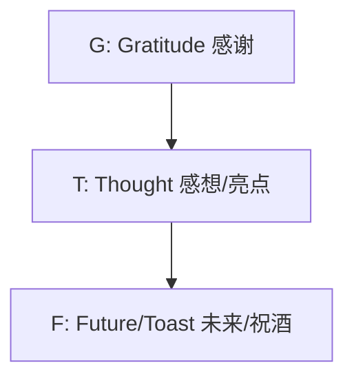

# 第10章｜社交场合插科打诨：破冰、接梗、圆场与即席致辞

> **本章摘要**：社交语言的本质不是“展示自我”，而是**“情绪价值的交换”**。
> 本章将社交表达视为一种**“声音与语言的柔道”**：如何在陌生环境中**破冰**建立连接？如何在闲聊中通过**插科打诨**制造愉悦感？如何在尴尬发生时**圆场**化险为夷？以及当聚光灯突然打在你身上时，如何用**结构化思维**完成精彩的即兴发言。
>
> **你将学到**：
> 1. **气场控制**：如何通过声音调整社交地位（Status）。
> 2. **无限话题流**：利用“挂钩”技术，让聊天永不冷场。
> 3. **幽默公式**：荒谬赞同、误读与回扣（Call-back）的实战用法。
> 4. **救场艺术**：应对忘名、口误、冒犯的紧急预案。
> 5. **即兴思维**：三种甚至不需要过脑子的发言模板。

---

## 10.1 社交发声与地位管理 (Status & Vibe)

在开口说话之前，你的声音状态已经决定了你在社交局中的“地位”。

### 1. 声音的“地位交易” (Status Transaction)
社交并不总是平等的。我们可以通过调整声音参数来灵活改变自己的社交地位，以适应不同目的。

| 模式 | 声音特征 | 肢体语言 | 适用场景 | 潜台词 |
| :--- | :--- | :--- | :--- | :--- |
| **高地位 (High Status)** | 语速稳、音量足、**敢于停顿**、少语尾上扬 | 占据空间大、眼神不闪躲 | 控场、发言、建立权威 | “我对比此地感到舒适且掌控。” |
| **低地位 (Low Status)** | 语速快、音量偏小、**填充词多**、语尾上扬 | 身体微缩、频频点头 | 示弱、道歉、避免冲突 | “我对你构不成威胁，请接纳我。” |
| **平视 (Equal/Friend)** | 节奏流动、有起伏、**呼吸同步** | 模仿对方姿态（镜像） | 破冰、闲聊、拉近关系 | “我们是一路人。” |

> **Rule of Thumb**：在陌生社交局，建议以**“平视”起手**，随后根据情况微调。如果对方攻击性强，可短暂切换“高地位”压制；如果对方紧张，可切换“低地位”安抚。

### 2. 能量投射：+10% 原则
不要做房间里的黑洞。你的能量（热情、音量、反应速度）需要比**当前对话者的平均水平高出 10%**。
*   **太低**：显得冷漠、无聊、或是看不起人。
*   **太高**：显得像推销员、聒噪、令人疲惫。
*   **+10%**：你是那个带着光的人，大家都想靠近你。

---

## 10.2 破冰与无限话题流 (Ice-breaking & Flow)

很多人的恐惧在于：“打完招呼后，我说什么？”

### 1. 话题开启：F.O.R.D 模型与“环境抓手”
虽然老套，但有效。
*   **F (Family/Friends)**：人际关系（慎用，除非已熟络）
*   **O (Occupation)**：职业与工作（最安全，但易无聊）
*   **R (Recreation)**：娱乐与兴趣（**最佳切入点**：旅游、运动、吃喝）
*   **D (Dreams)**：愿景与吐槽（深层连接）

**实战起手式：环境抓手 (Contextual Hook)**
不要直接查户口。先谈论**你们共处的此时此地**。
*   ✅ “这酒店的冷气是不是不要钱？我感觉像进了冷库。”（共同痛点）
*   ✅ “你看那边甜点台排队的人，我猜那提拉米苏一定很好吃，或者就是很难夹。”（共同观察）

### 2. 让对话不断的“挂钩技术” (Hooking)
对话像攀岩，对方的一句话里其实有很多“岩点”（信息点），你要学会抓住一个往上爬。

**案例**：
> 对方：“我刚从**成都**出差回来，累死了，**飞机**还晚点。”

这里有三个钩子：
1.  **成都**（地点/美食）：
    *   接：“哦？成都！去吃火锅了吗？还是去看了花花（熊猫）？”
2.  **出差/累**（状态/工作）：
    *   接：“最近业务这么忙？看来是年底冲刺节奏啊。”
3.  **飞机晚点**（交通/遭遇）：
    *   接：“最近天气是不好。晚了多久？我有次在机场等到两点，人都麻了。”

### 3. “我”与“你”的平衡
*   **只说“你”** = 审问（“哪人？”“多大？”“干嘛的？”）
*   **只说“我”** = 自恋（“我跟你说我昨天……”）
*   **黄金比例**：先简短**自我暴露**，再**抛回问题**。
    *   ✅ “我是做IT的，平时那是相当枯燥，头发都快掉光了（自我暴露）。您这行是不是特别有趣？（抛回）”

---

## 10.3 插科打诨：幽默的实战技术

插科打诨的核心不是讲笑话，而是**“不按套路出牌的轻松感”**。

### 1. 荒谬赞同法 (Absurd Agreement)
当对方在抱怨或自嘲时，不要急着安慰，而是**顺着他的逻辑夸张到荒谬**。

*   **场景**：朋友抱怨：“我这记性，真的是金鱼脑。”
*   **普通安慰**：“哎呀没事，大家都一样。”（无聊）
*   **荒谬赞同**：“那你这金鱼还得是品种好的，据说金鱼只有7秒记忆，我感觉你这至少能撑8秒，赢在起跑线上了！”
*   **场景**：同事：“这甲方太难伺候了。”
*   **荒谬赞同**：“我怀疑他们是不是派了个AI来跟我们对接，专门做过‘如何折磨人类’的深度学习。”

### 2. 故意误读 (Deliberate Misinterpretation)
对词语进行字面意思的曲解，或者将严肃话题生活化。

*   **场景**：某人介绍：“这位是李总，他是搞**风投**的。”
*   **插科打诨**：“久仰久仰！那您身体一定很好，一般人‘疯’起来也没那么大‘劲头’（风投谐音/曲解）。”
*   **场景**：对方：“我们要追求极致的**颗粒度**。”
*   **插科打诨**：“懂了，那今晚聚餐咱们就不喝粥了，得吃炒饭，那个颗粒度比较明显。”

### 3. 借物喻人与通感
用具体、形象、甚至有点损（但不伤人）的比喻。

*   **形容忙**：“我今天忙得像个旋转的陀螺，还是被鞭子抽的那种。”
*   **形容饿**：“别跟我说话，我现在看这桌子腿都像是火腿肠做的。”

### 4. 回扣 (Call-back)
这是**高级幽默**的标志。在对话进行了10-20分钟后，突然引用之前出现过的一个梗或话题。

*   **铺垫**：刚开始聊到了某人怕老婆。
*   **中间**：聊到了国际局势、油价上涨。
*   **回扣**：对方问“你说如果油价再涨怎么办？”，你答：“那不仅车开不动，我估计某人回家跪键盘的成本也得涨，毕竟键盘也是塑料做的（石油制品）。”

---

## 10.4 圆场与救急：做社交圈的“安全气囊”

无论你多小心，社交场合总有尴尬时刻。

### 1. 忘记名字怎么办？
这是最常见的噩梦。
*   **战术A（甩锅给手机）**：“咱们加个微信吧？唉我这手机输入法有点卡，要不你自己输一下昵称？”
*   **战术B（坦诚但幽默）**：“实在抱歉，我今天的脑容量刚才被那个PPT占满了，你是……提醒我一个字？”
*   **战术C（介绍第三方）**：把朋友拉过来：“哎老王，这位是……（停顿，看对方）”，对方通常会自己补上：“你好，我是小李。”

### 2. 遇到冒犯性玩笑（软回击）
如果有人让你下不来台，不要发怒，也不要忍受。用**“过分解读”**让对方尴尬。

*   **攻击**：“哟，你怎么还没结婚啊？眼光太高了吧？”
*   **软回击（一本正经）**：“是啊，我一直在等国家分配呢，您有没有路子帮我催催民政局？我这号排得太靠后了。”
*   **攻击**：“你看你，穿得跟个红包似的。”
*   **软回击**：“那赶紧的，见者有份，里头没钱，也就是讨个吉利，您多担待。”

### 3. 应对冷场 (Dead Air)
当空气突然安静，不要在这个时刻看手机，否则场面会彻底死掉。
*   **诚实打破法**：“哇，咱们刚才这几秒钟的沉默，如果不配点背景音乐，简直就是电影里的悬疑片现场。”
*   **重启话题法**：“说到刚才那个话题，其实还有个更有意思的事儿……”

---

## 10.5 即席致辞：G.T.F. 与 P.R.E.P. 模型

当领导或主持人突然说：“下面请XX讲两句。” 你的心跳加速到180。别慌，套公式。

### 模型一：G.T.F. (聚会/庆功/婚礼/饭局)
最适合**情感导向**的场合。

*   **G (感谢)**：感谢攒局的人，感谢在场的人。“谢谢张总今天的款待……”
*   **T (感想)**：**只讲一个点**！不要回顾全程。讲一个细节。“今天最让我触动的是刚才那道鱼，让我想起咱们项目组那种‘如鱼得水’的默契……”
*   **F (未来)**：祝愿 + 提议干杯。“希望咱们明年的业绩也像这鱼一样，力争上游！来，干杯！”

### 模型二：P.R.E.P. (会议/商务/观点表达)
最适合**逻辑导向**的场合。

*   **P (Point 观点)**：直接说结论。“我觉得这个方案可行。”
*   **R (Reason 理由)**：因为什么。“因为不仅成本可控，而且……”
*   **E (Example 案例/证据)**：举个例子。“比如去年我们在XX项目上……”
*   **P (Point 重申)**：换句话重复结论。“所以，我非常支持这个方向。”

### 模型三：时间轴 (Past-Present-Future)
最适合**述职、自我介绍、总结**。

*   **Past (过去)**：我们从哪来？（回顾初心/背景）
*   **Present (现在)**：我们在哪？（现在的挑战/成绩）
*   **Future (未来)**：我们要去哪？（下一步行动/愿景）

---

## 10.6 常见陷阱与错误 (Gotchas)

| 陷阱 | 表现 | 为什么错 | 修正方案 |
| :--- | :--- | :--- | :--- |
| **过度用力 (Try Hard)** | 拼命讲段子，笑声只有自己在笑，打断别人说话抢梗。 | 破坏了“社交流动性”，让人感到压力。 | **Relaaaaax**. 幽默是甜点，不是主食。如果你感觉在费劲，就停下来倾听。 |
| **甚至有点“油腻”** | 乱开黄腔、过度称赞异性外貌、自以为是的“懂王”说教。 | 极度败坏好感，尤其在异性面前。 | **去油指南**：不评价外貌，不评价私德，多自嘲，少说教。 |
| **负能量黑洞** | 见面就吐槽交通、吐槽天气、吐槽工作。 | 没人喜欢垃圾桶。 | 把“抱怨”转化为“荒谬的观察”。如果不幽默，就闭嘴不抱怨。 |
| **封闭式回答** | “你是哪人？”“北京。”（结束）。 | 杀死了对话。 | **回答+1**：“北京的，不过我最近都住东边，那边堵车简直一绝。你呢？” |
| **不懂装懂** | 对方聊专业领域，你强行插嘴发表外行看法。 | 露怯，且不尊重人。 | **示弱提问**：“这个领域我特别好奇但不太懂，您刚才说的那个概念，是不是可以理解为……？” |

---

## 10.7 练习题

<strong>练习 1：荒谬赞同（Banter）</strong>

<strong>场景</strong>：你的朋友发际线后移，他在自嘲：“哎，感觉我的发际线在撤退。”
 请尝试用“荒谬赞同”法回应，不要简单的安慰。

> **Hint**: 赋予发际线一个“战略意图”或者“智力象征”。
>  **参考答案**：
> 1. “这不叫撤退，这叫‘战略纵深’，为了给你的高智商腾出更多展示面积。”
> 2. “挺好，以后洗脸面积变大了，省洗发水费洗面奶，这是消费降级的好手段。”

<strong>练习 2：无限话题流（Hooking）</strong>

<strong>场景</strong>：对方说：“我周末一般就在家**打游戏**，偶尔**遛遛狗**。”
 请找出至少两个“钩子”，并设计追问。

> **Hint**: 钩子是“游戏”和“狗”。
>  **参考答案**：
> 1. (钩住游戏)：“是吗？最近在玩什么大作？我最近手残，正缺个大神带带。”
> 2. (钩住狗)：“养狗好啊！是什么品种？是不是那种拆家能力特别强的哈士奇？”

<strong>练习 3：即兴致辞（G.T.F.）</strong>

<strong>场景</strong>：你是新员工，迎新聚餐上，领导让你跟大家打个招呼。
 请套用 G.T.F. 模板，在 45 秒内说完。

> **Hint**: G(感谢大家接纳)-T(初来乍到的感受/决心)-F(以后请多关照)。
>  **参考答案**：
> 1. **(G)** 真的非常感谢主管组这个局，也谢谢各位前辈今天能来，让我蹭这一顿大餐。
> 2. **(T)** 我刚来这几天，最大的感受就是咱们团队不仅专业，而且氛围特别暖——就像这顿火锅一样热辣滚烫。能加入这里我觉得特别幸运。
> 3. **(F)** 以后在工作上我不懂的地方，还得麻烦大家多拎一拎。这一杯我干了，大家随意！

<strong>练习 4：高难度救场（圆场）</strong>

<strong>场景</strong>：你在介绍两个人认识，结果把其中一人的名字叫错了（叫成了他前任的名字，或者完全无关的名字）。场面一度非常尴尬。
 请设计一句“救场词”。

> **Hint**: 承认错误 + 夸张归因 + 快速翻篇。
>  **参考答案**：
> “哎呀！我这张嘴即使捐了都没人要！刚看完那个电视剧/刚聊完那谁，脑子还在那儿没回来呢。实在对不住，该罚该罚，咱们重来一遍——隆重介绍一下，这位是……”

---

## 10.8 本章小结

社交场合的语言艺术，本质上是**关注力**的艺术。
1.  **关注环境**：用来破冰。
2.  **关注对方**：用来接梗和提问。
3.  **关注此时此刻的情绪**：用来圆场和调节气氛。
4.  **不关注自己**：忘掉“我要表现得完美”，你就会松弛下来，而松弛是社交最大的魅力。
